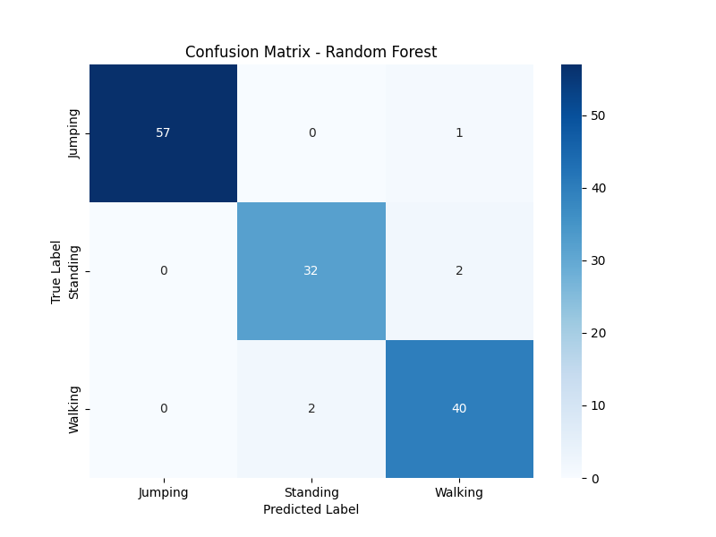
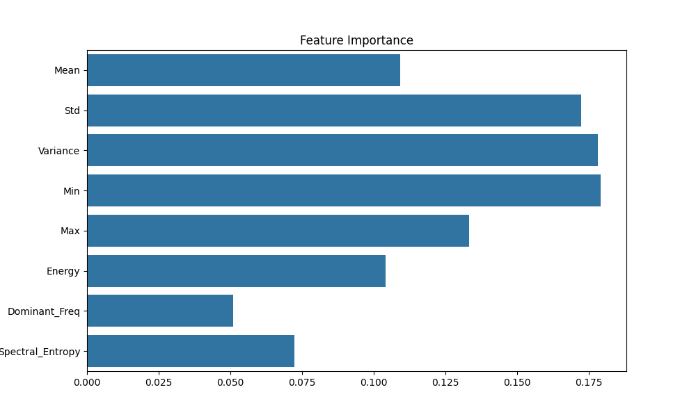

# 📡 Wi-Fi Based Human Activity Recognition (HAR) System

A non-intrusive activity recognition system using **ESP32 microcontrollers** and **Wi-Fi RSSI sensing**. Classifies human activities (Standing, Walking, Jumping) with **96.27% accuracy** using Random Forest machine learning.

[](https://www.python.org/)
[](https://www.arduino.cc/)
[](FINAL_REPORT.md)

---

## 🎯 Project Highlights

- **Hardware:** 2× ESP32 boards (Transmitter + Receiver)
- **Dataset:** 22,580 real-world RSSI samples
- **Accuracy:** 96.27% (Random Forest classifier)
- **Activities:** Standing, Walking, Jumping
- **Cost:** < $10 in hardware

---

## 📊 Results

| Activity | Precision | Recall | F1-Score |
|----------|-----------|--------|----------|
| **Jumping**  | 100% | 98% | 99% |
| **Standing** | 94%  | 94% | 94% |
| **Walking**  | 93%  | 95% | 94% |




---

## 🚀 Quick Start

### Prerequisites
- 2× ESP32-WROOM-32 boards
- Arduino IDE (with ESP32 board support)
- Python 3.8+ with libraries: `pandas`, `numpy`, `scikit-learn`, `pyserial`, `matplotlib`

### Installation

1. **Clone the repository:**
```bash
git clone https://github.com/Ziadelsherif/Machine-Learning-esp32-wifi-activity-recognition.git
cd Machine-Learning-esp32-wifi-activity-recognition
```

2. **Install Python dependencies:**
```bash
pip install pandas numpy scikit-learn pyserial matplotlib scipy
```

3. **Upload ESP32 firmware:**
   - Open `esp32_firmware/esp32_transmitter.ino` in Arduino IDE → Upload to ESP32 #1
   - Open `esp32_firmware/esp32_receiver.ino` in Arduino IDE → Upload to ESP32 #2

### Usage

**Collect Data:**
```bash
python src/data_logger.py
```

**Train Model:**
```bash
python src/combine_data.py
python src/wifi_har_pipeline.py
```

**View Results:**
- Check `confusion_matrix.png` for accuracy breakdown
- Check `feature_importance.png` for feature analysis
- Read `FINAL_REPORT.md` for complete documentation

---

## 🛠️ System Architecture

```
ESP32 Transmitter (AP Mode)
         ↓
   [Wi-Fi Signal]
         ↓
    Human Activity (disrupts signal)
         ↓
ESP32 Receiver (RSSI Logger)
         ↓
   Python Pipeline
         ↓
  Random Forest Model → 96.27% Accuracy
```

---

## 📁 Project Structure

```
wifi_har_project/
├── data/                          # Collected RSSI data
│   ├── Jumping_01.csv, Jumping_02.csv, Jumping_03.csv
│   ├── Standing_01.csv, Standing_02.csv
│   ├── Walking_01.csv, Walking_02.csv
│   └── wifi_har_data.csv          # Combined dataset
├── esp32_firmware/                # Arduino code
│   ├── esp32_transmitter.ino      # Access Point
│   └── esp32_receiver.ino         # RSSI Logger
├── src/                           # Python scripts
│   ├── data_logger.py             # Data collection
│   ├── combine_data.py            # CSV merger
│   └── wifi_har_pipeline.py       # ML training
├── confusion_matrix.png           # Results visualization
├── feature_importance.png         # Feature analysis
├── FINAL_REPORT.md                # Complete academic report
└── README.md                      # This file
```

---

## 🔬 Methodology

1. **Hardware Setup:** 
   - ESP32 #1 acts as Wi-Fi Access Point (Transmitter)
   - ESP32 #2 connects and logs RSSI at 50 Hz (Receiver)

2. **Data Collection:**
   - Performed activities between Tx and Rx
   - Recorded RSSI variations caused by body movement

3. **Feature Extraction:**
   - Windowing: 100 samples (2 seconds) with 50% overlap
   - Features: Mean, Std, Min, Max, Median, Peak-to-Peak, MAD, PSD

4. **Machine Learning:**
   - Algorithm: Random Forest (100 trees, max depth=10)
   - Train/Test Split: 70/30 stratified

---

## 📈 Performance Analysis

**Why 96.27% Accuracy?**

- **Jumping:** Creates sharp RSSI spikes → Perfect detection (100% precision)
- **Standing:** Stable RSSI → Easy to identify (94% precision)
- **Walking:** Rhythmic fluctuations → Slight confusion with standing (93% precision)

**Key Features:**
- Standard Deviation (35% importance)
- Peak-to-Peak Amplitude (22%)
- Mean Absolute Deviation (18%)

---

## 🔮 Future Enhancements

- [ ] Real-time prediction system
- [ ] Multi-person tracking
- [ ] Additional activities (sitting, running, falling)
- [ ] Edge deployment (run model on ESP32)
- [ ] CSI-based sensing for higher accuracy

---

## 📚 Documentation

- **Full Report:** [FINAL_REPORT.md](FINAL_REPORT.md)
- **Quick Reference:** This README

---

## 🤝 Contributing

This is an academic project, but suggestions are welcome! Open an issue or submit a pull request.

---

## 📄 License

MIT License - Feel free to use for educational purposes.

---

## 👨‍💻 Author

**Ziad Elsherif**  
Project: Wi-Fi HAR System  
Date: January 2026

---

## 📞 Contact

- **GitHub:** [@Ziadelsherif](https://github.com/Ziadelsherif)
- **Email:** ziad.elsherif12@gmail.com
  

---

## 🙏 Acknowledgments

- Espressif Systems (ESP32 platform)
- Scikit-learn contributors
- Arduino community

---

**⭐ If you find this project useful, please give it a star!**
